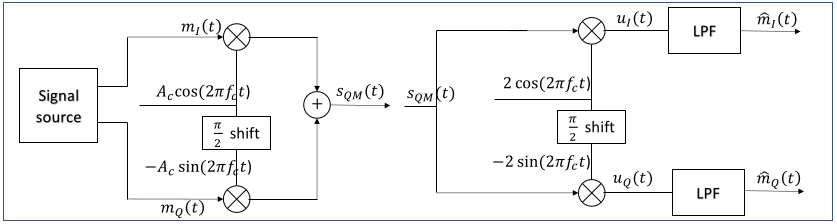
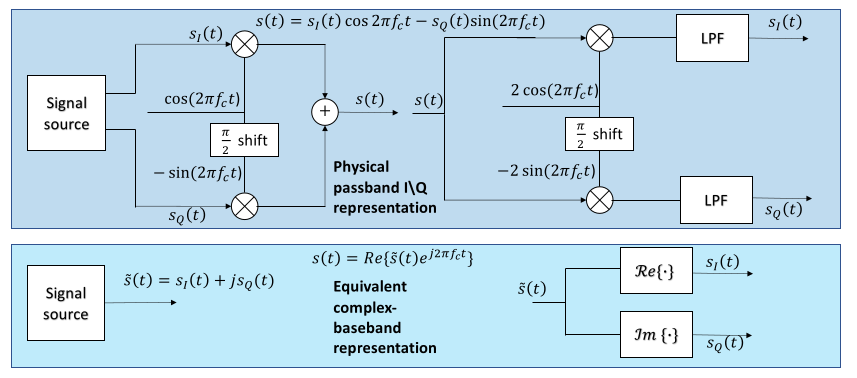

# 1. Index

- [1. Index](#1-index)
- [2. Analog Communications](#2-analog-communications)
  - [2.1. Dual Side-Band Modulation - `DSB`](#21-dual-side-band-modulation---dsb)
  - [2.2. Quadrature Amplitude Modulation - `QAM`](#22-quadrature-amplitude-modulation---qam)
  - [2.3. Passband Signals](#23-passband-signals)
    - [2.3.1. Carrier Mismatch in Complex Baseband representation](#231-carrier-mismatch-in-complex-baseband-representation)
  - [2.4. Angle Modulation](#24-angle-modulation)
  - [2.5. Frequency Modulation - `FM`](#25-frequency-modulation---fm)
    - [2.5.1. FM Signal Spectrum](#251-fm-signal-spectrum)
    - [2.5.2. Features and Trade-offs of FM](#252-features-and-trade-offs-of-fm)
    - [2.5.3. FM Receivers](#253-fm-receivers)

# 2. Analog Communications

Information signals, such as speech and audio, are typically generated at
_baseband_, which is a non-zero signal centered at $f = 0$:

$$
  m(t) \Leftrightarrow M(f), \quad \text{concentrated around } f = 0
$$

Thus, in order to avoid noise between different signals, wireless transmission
requires each signal to be moved to an appropriate radio-frequency band.
This process is called **modulation**, and it allows us to:

- Translate baseband information to a suitable radio-frequency band;

- Enable efficient radiation and reception with practical antennas;

- Allow multiple services and users to share the radio spectrum.

## 2.1. Dual Side-Band Modulation - `DSB`

It's the simplest form of analog modulation.

It can translate a baseband message $m(t)$ to a radio-frequency band by
**multiplying it by a sinusoidal carrier**:

$$
s_{DSB}(t) = A_cm(t)\cdot \cos{(2\pi f_c t)}
$$

The $m(t)$ controls the amplitude and sign of the carrier.

Multiplication by a sinusoidal carrier creates two shifted copies of the
baseband spectrum around $f_c$ and $-f_c$.

This can be proved by analyzing the Fourier's transformations theorems and definitions:

$$
\begin{matrix}
  \cos{(2\pi f_c t)} \Leftrightarrow \frac{1}{2}[\delta(f - f_c) +
    \delta(f + f_c)] \\
  S_{DSB}(f) = \frac{A}{2}[M(f - f_c) + M(f + f_c)]
\end{matrix}
$$

Neglecting the effect related to noise and propagation channels, the recovery
of $m(t)$ from $s_{DSB}(t)$ (or _demodulation_) is possible with **coherent detection**.
The receiver has to multiply the signal by a locally generated carrier with
_the same frequency and phase_ of the transmitter's carrier:

$$
  u(t) = 2s_{DSB}\cos{(2\pi f_c t)} = A_c m(t) + A_c m(t) \cos{(4\pi f_c t)}
$$

To recover the original signal $m(t)$ we just have to filter with a
_Band-Pass-Filter_ (`BPF`) the higher
frequencies from $u(t)$.

## 2.2. Quadrature Amplitude Modulation - `QAM`

Several amplitude-modulation schemes can be obtained by modifying how the
carrier and the side-bands are transmitted.

Rather than reviewing all analog amplitude-modulation schemes, on this course
we focus on **Quadrature Modulation**.

This type of modulation allows two independent messages to share the same
frequency band without interfering by **modulating two orthogonal carriers**.

The use of this technique naturally introduces the in-phase $I(t)$ and
quadrature $Q(t)$ components, using the same principles that digital QAM and many
modern communication system use.

Two signals $x_1(t)$ and $x_2(t)$ are _orthogonal_ over an interval $T$ if:

$$
\int_{t_0}^{t_0 + T}{x_1(t) x_2^\ast(t)\;dt} = 0
$$

The simplest example of two orthogonal signals over any integer number $k$ of
periods $(T = kT_c = \frac{k}{f_c})$
that carry the same frequency are _sine_ and _cosine_ with a phase difference
of 90°:

$$
  \int_{t_0}^{t_0 + T}{\cos{(2\pi f_c t)}\sin{(2\pi f_c t)}\;dt} = 0
$$

Since the signal are orthogonal, they can _overlap in time and frequency_ and
still be separated by an appropriate receiver:

- **Quadrature Modulation**: uses the orthogonality between sine and cosine.

- **Orthogonal Frequency Dual Modulation**: uses the orthogonality between
  sub-carriers at different frequencies.

Using _sine_ and _cosine_ we can transmit two orthogonal carriers in the same frequency:

$$
s_{QM}(t) = A_c m_I(t) \cos{(2\pi f_c t)} - A_c m_Q(t) \sin{(2\pi f_c t)}
$$

At the receiver, coherent mixing with the same carriers shifts the desired
components to baseband, while the cross-component and the remaining
high-frequency terms are centered around $2f_C$, and can be filtered out by
Low-Pass Filters (`LPF`):

$$
\begin{matrix}
    \hat{m}_I(t) = A_c m_I(t) & & \hat{m}_Q(t) = A_c m_Q(t)
\end{matrix}
$$

Therefore, the quadrature-modulated signal is described by two real baseband components
that can be combined into one complex signal:

$$
\tilde{s}_{QM}(t) = A_c m_I(t) + jA_c m_Q(t)
$$

The physical **passband** waveform is recovered as just:

$$
  s_{QM}(t) = \text{Re}\Set{\tilde{s}(t)e^{j2\pi f_c t}}
$$

## 2.3. Passband Signals

The majority of communication systems are _passband systems_.

A passband signal $s(t)$ has its spectrum concentrated around a
non-zero carrier frequency $f_c$, and, in most communication systems, these
signals are also _narrowband_ $(f_c \gg B)$.

Any passband signal $s(t)$ can be represented as:

$$
\begin{align*}
s(t) &= \text{Re}\Set{\tilde{s}(t)e^{j2\pi f_ct}} \\
     &= s_I(t) \cos{(2\pi f_ct)} - s_Q(t) \sin{(2\pi f_ct)}
\end{align*}
$$

Where $\tilde{s}(t) = s_I(t) + js_Q(t)$ is called **Complex Envelope** of the
signal $s(t)$, where $s_I(t) = \text{Re}\Set{\tilde{s}(t)}$ and
$s_Q(t) = \text{Im}\Set{\tilde{s}(t)}$.

The complex envelop is an equivalent baseband representation of a passband signal.

Employing the baseband equivalent has several benefits:

- **Easier to study**: it removes the effects of the carrier frequency from
  the signal model.
- **Better Numerically simulated**: since the bandwidth is lower, also the
  sampling rate, which must be at least _twice the bandwidth_, is lower,
  lowering the computation complexity
- **Basis for Digital Implementation for Passband Communication Systems**.

In the following image we can see a comparison between the **Passband Model**
and the **Equivalent Baseband Model**.

### 2.3.1. Carrier Mismatch in Complex Baseband representation

In a practical receiver, the phase $\phi_{LO}$ and the frequency $f_{LO}$ of
the local oscillator **may not be exactly equal** to the phase $\phi_c$ and
frequency $f_c$ of the received carrier:

$$
\begin{matrix}
  \Delta f = f_c - f_{LO} & & \Delta \phi = \phi_c - \phi_{LO}
\end{matrix}
$$

Therefore, the received complex envelope takes this form:

$$
\tilde{v}_{off}(t)  = \tilde{v}(t)e^{j(2\pi \Delta ft + \Delta \phi)}
$$

In complex baseband, a phase offset causes a _fixed rotation_, whereas a
frequency offset causes a _progressive rotation_.

## 2.4. Angle Modulation

We said that a passband signal can be represented as:

$$
  s(t) = A(t)\cos{(2\pi f_c t + \phi_m(t))}
$$

Accordingly, we can convey different informations by varying the **amplitude**
$A(t)$ and/or the information-bearing phase $\phi_m(t)$.

Since the instantaneous frequency is the _time derivative of the total phase_,
we can write:

$$
\begin{align*}
  f_i(t) &= \frac{1}{2\pi} \frac{d}{dt} (2\pi f_c t + \phi_m(t)) \\
         &= f_c + \frac{1}{2\pi} \frac{d}{dt} \phi_m(t) \\
\end{align*}
$$

This highlight the fact that changing the phase **also produces a time-varying
instantaneous frequency**.

More in general we will see that _angle modulation_ includes _phase
modulation_ and _frequency modulation_.

## 2.5. Frequency Modulation - `FM`

In _frequency modulation_, the _instantaneous frequency deviation_ is linearly
proportional to the message:

$$
\Delta f_i(t) = f_i(t) - f_c = \frac{1}{2\pi}\frac{d}{dt} \phi_m(t) = k_fm(t)
$$

Since $\frac{d \phi_m(t)}{dt} = 2\pi k_f m(t)$, it follows that the
information-bearing phase term is **the integral of the message**:

$$
  \phi_m(t) = 2\pi \int_{-\infty}^t{k_f m(\tau)\;d\tau}
$$

All said, the passband `FM` modulated signal is:

$$
  s_{FM}(t) = A_c \cos{\Biggl(2\pi f_c t + 2\pi k_f \int_{-\infty}^t{m(\tau)\;d\tau}\Biggr)}
$$

The complex envelope of a `FM` signal is:

$$
  \tilde{s}_{FM}(t) = A_c e^{j2\pi k_f \int_{-\infty}^t{m(\tau);d\tau}} = A_c e^{j\phi_m(t)}
$$

Since it is true that $\vert \tilde{s}_{FM}(t) | = A_c$, we can say that
**Frequency Modulation is a _constant-envelope_ modulation**.

The maximum frequency deviation is then defined as:

$$
\begin{align*}
\Delta f &= \max_t \{\vert \Delta f_i (t) \vert \} \\
         &= k_f \max_t \{\vert \Delta f_i (t) \vert \}
\end{align*}
$$

To study the FM spectrum, we first consider a _single-tone_ message
$m(t) = V_m \cos{(2\pi f_m t)}$

Thus, the FM signal is:

$$
\begin{align*}
  s_{FM}(t) &= A_c \cos{\left(2\pi f_c t + 2\pi k_f
    \int_{-\infty}^t{V_m \cos{(2\pi f_m \tau)}\;d\tau}\right)} \\
            &= A_c \cos{\left(2\pi f_c t + 2\pi k_f V_m \frac{1}{2\pi f_m}
    \sin{(2\pi f_m t)}\right)} \\
            &= A_c \cos{\left(2\pi f_c t + \frac{k_f V_m}{f_m} \sin{(2\pi f_m t)}\right)}
$$

If we consider $m_f = \frac{\Delta f}{B} = \frac{k_f V_m}{f_m}$ as the
_modulation index_, we can write the complex envelope as:

$$
\tilde{s}_{FM}(t) = A_c e^{j m_f \sin{(2\pi f_m t)}}
$$

### 2.5.1. FM Signal Spectrum

For a sinusoidal message, the complex envelope is _periodic_ of period
$T_m = \frac{1}{f_m}$, and can be expanded in a Fourier series:

$$
\tilde{s}_{FM}(t) = A_c \sum_{n}{S_n e^{j2\pi n f_m t}}
$$

Where the coefficients $S_n$ are **Bessel functions of the first kind**:

$$
\begin{align*}
  S_l &= \frac{1}{T_m} \int_{-T_m/2}^{T_m/2}{e^{j m_f \sin{(2\pi f_m t)}}
                             e^{-j 2\pi l f_m t}\;dt} \\
      &= \frac{1}{2\pi} \int_{-\pi}^{\pi}{e^{j(m_f \sin{(\theta)} - l\theta)}\;
                              d\theta} \\
      &= J_l(m_f)
\end{align*}
$$

Thus, we can write our complex envelope as:

$$
  \tilde{s}_{FM}(t) = A_c \sum_{n}{J_n(m_f) e^{j2\pi n f_m t}}
$$

The passband signal is then:

$$
\begin{align*}
  s_{FM}(t) &= A_c \sum_{n}{J_n(m_f) \cos{(2\pi (f_c + n f_m) t)}} \\
            &= \sum_{n}{A_n \cos{(2\pi f_n t)}}
\end{align*}
$$

Where $A_n = A_c J_n(m_f)$ and $f_n = f_c + n f_m$.

To interpret this result, we use the property of _Bessel functions_ that
states that $J_{-n}(m_f) = (-1)^n J_n(m_f)$, which shows that the upper and
lower sidebands are symmetric around the carrier frequency $f_c$, and have the
same magnitude.

As $m_f$ increases, higher-order sidebands become significant. Since adjacent
sidebands are spaced by $f_m$, the _effective bandwidth_ grows roughly
as $2(m_f + 1)f_m$.

For a general message signal, the FM spectrum does not admit a simple closed-form
expression, but a good approximation can be made following the _Carson
bandwidth rule_:

$$
  B_{FM} \approx 2(m_f + 1)B = 2(\Delta f + B)
$$

Although a FM signal theoretically has infinite bandwidth, approximately 98%
of the signal power is contained in a bandwidth of $B_{FM}$.

In commercial mono FM we have $B_{FM} \approx 180\;kHz$, in which:

- $B = f_m = 15\;kHz$ is the maximum baseband frequency of the audio signal;
- $\Delta f = 75\;kHz$ is the maximum frequency deviation.
- $m_f = \frac{\Delta f}{B} = 5$
- Channel spacing is $200\;kHz$.

### 2.5.2. Features and Trade-offs of FM

Some of the most important features of FM are:

- **Constant Envelope**: FM signals have a constant amplitude, which allows
  the use of non-linear power amplifiers that are more efficient.
- **Bandwidth-noise robustness trade-off**: increasing $k_f$ (and hence
  $\Delta f$) FM can achieve better noise performance than AM, but at the cost
  of increased bandwidth.
- **Capture effect**: In FM, when two signals are present at the nearby
  frequency, the stronger signal tends to dominate, effectively "capturing" the
  receiver and suppressing the weaker signal.
- **Threshold effect**: FM receivers provides a good noise performance only
  above a certain threshold. Below it, the signal quality degrades rapidly,
  leading to a sudden loss of intelligibility.

### 2.5.3. FM Receivers

Neglecting the effect of noise and channel, the complex envelope of the
received signal is:

$$
\tilde{v}(t) = A_c e^{j2\pi k_f \int_{-\infty}^t{m(\tau)\;d\tau}}
$$

The modulating signal can be recovered by **differentiating the phase** of the
complex envelope:

$$
  \hat{m}(t) = \frac{1}{2\pi k_f} \frac{d}{dt} \phase{\tilde{v}(t)}
$$

FM demodulations rejects constant phase errors, and converts frequency offsets
into DC bias:

$$
\begin{CD}
\begin{align*}
  \tilde{v}_{off}(t) &= A_c e^{j(2\pi k_f \int_{-\infty}^t{m(\tau)\;d\tau}}
                          e^{2\pi \Delta f_{off} t + \Delta \phi)} \\
  \phase{\tilde{v}_{off}(t)} &= 2\pi k_f \int_{-\infty}^t{m(\tau)\;d\tau}
                                + 2\pi \Delta f_{off} t + \Delta \phi \\
  \frac{d}{dt}{\phase{\tilde{v}_{off}(t)}} &= 2\pi k_f m(t) + 2\pi \Delta f_{off}
\end{align*} \\
@VVV \\
\begin{align*}
  \hat{m}_{off}(t) &= \frac{1}{2\pi k_f} \frac{d}{dt} \phase{\tilde{v}_{off}(t)}\\
                  &= m(t) + \frac{\Delta f_{off}}{k_f}
\end{align*}
$$

Typically, the frequency offset is small enough that it can be removed by a
high-pass filter, which removes the DC bias.
