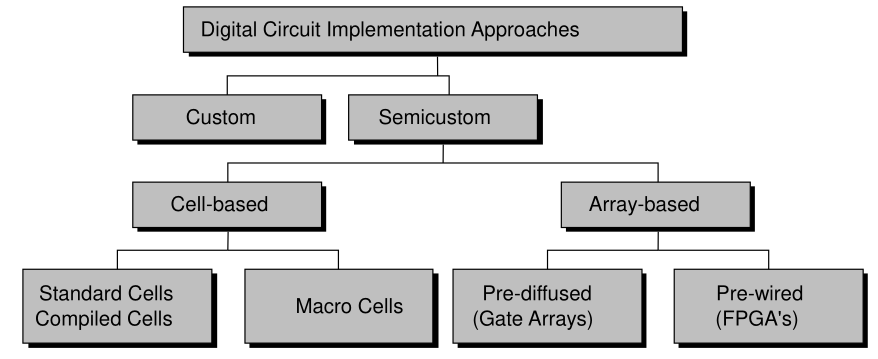
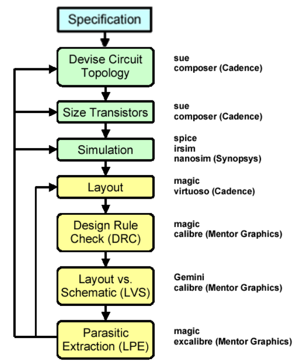
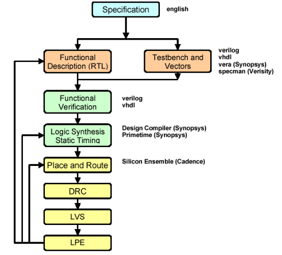
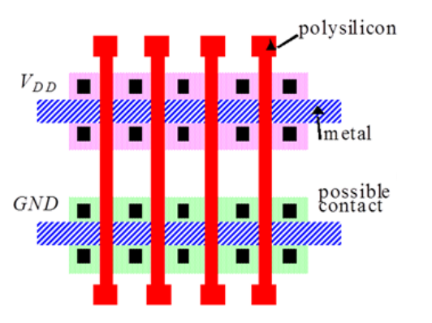
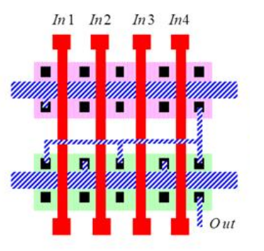

# 1. Index

- [1. Index](#1-index)
- [2. IC Design Styles and Flows](#2-ic-design-styles-and-flows)
  - [2.1. Design Abstraction](#21-design-abstraction)
    - [2.1.1. Full Custom](#211-full-custom)
    - [2.1.2. Semi Custom](#212-semi-custom)
      - [2.1.2.1. Gate Arrays Structure](#2121-gate-arrays-structure)
      - [2.1.2.2. Standard Cell Structure](#2122-standard-cell-structure)
      - [2.1.2.3. Usage of Intellectual Property (IP) Cores](#2123-usage-of-intellectual-property-ip-cores)

# 2. IC Design Styles and Flows

The first step to pay attention to when designing an IC (Integrated Circuit)
is to understand the **Electronic Abstraction Level Design**.

This is a process that allows designers to create complex electronic systems
by breaking them down into manageable levels of abstraction. Each level
represents a different perspective of the system, from high-level functional
descriptions to low-level physical implementations.

With higher levels of abstraction, in the same timespan, the IC complexity the
designer is able to handle increases relevantly.

With software support, going from _System Level Description_ to _Register
Transfer Level (RTL) Description_ is a matter of hours, while going from _RTL
Description_ to _Gate Level Description_ can take days or even weeks,
depending on the complexity of the design.
We don't even talk about _Transistor Level Description_ or _Geometric Level
Description_, which can take months or even years to complete.

The _IC Design Styles_ can be organized into a hierarchy of abstraction
levels, each with its own set of design methodologies and tools.

**Full Custom** design is what we can call "Whatever, However, Wherever"
design. It is the most flexible and powerful design style, allowing designers
to create custom circuits that are optimized for performance, power, and area.
However, it is also the most time-consuming and expensive design style,
requiring a high level of expertise and specialized tools.

Instead, **Semi-Custom** design is a design style that uses pre-designed
building blocks. To create custom circuits. This design style is less flexible
than full custom design but is faster and less expensive, making it a popular
choice for many IC designs.

## 2.1. Design Abstraction

### 2.1.1. Full Custom

When working with **Full Custom** components design, the workflow is almost the
same every time.

The first step is the _Specification_, in which we just describe what we want
to build.
In this phase we give a description of the system functionalities, timing, size,
power consumption, and other relevant parameters.

After understanding the specifications, we start with the _Device Circuit
Topology_, sizing the transistors and simulating the circuit to verify that it
meets the specifications.
In case the simulation proves that our circuit is not good enough, we go back to
the _Device Circuit Topology_ phase and iterate until we find the best solution.

The simulation will give us several operating setting for the same component,
in a _Worst_, _Typical_ and _Best Case_ scenario.

When the simulation is successful, we move to the _Layout_ phase, in which we create
the physical layout of the circuit, placing and routing the transistors and
interconnections.

The design will be later verified with a **Design Rule Check (DRC)**, which
checks that the layout meets the design rules of the fabrication process, and
a **Layout Versus Schematic (LVS)** check, which verifies that the schematics
generated from the layout matches the original.

The last step is the **Parasite Extraction** (LPE), in which we extract/consider
the parasitic capacitances and resistances from the layout and simulate the
circuit again to verify that it still meets the specifications.

### 2.1.2. Semi Custom

Instead, when working with **Semi-Custom** components design, we give up the liberty
of doing whatever we want, to acquire the speed of using pre-designed components
that we know are already verified and optimized.

When we have the specifications, we can give the software the specifications
(vhdl) and the whole process we described before will be completely automated.

This automated process has the problem that there is no way to make _prior
feasibility verification_. For example, we are free to give the software a requirement
of `Area: 0`. The system, instead of telling us that it is impossible, will
find the most _area-efficient_ solution, which will be a circuit that is not
necessarily what we want.

Another problem is that the synthesis process doesn't actually place the
components on the chip, but just knows how they are connected.

For this reason, there is one more phase of _Place and Route_, in which the
software will place the components on the chip, and will then perform the
`DRC`, `LVS` and `LPE`.

This last phase, called _backend_, is different from the full custom design
flow, in which the designer has to do everything by hand, while the first phase,
called _frontend_, is the same for both design styles.

#### 2.1.2.1. Gate Arrays Structure

The **Gate Array Structure** is a semi-custom design style that uses already
set integrated circuits, with fixed I/O pads number and position.

These circuits are composed of cells (_gates_), which are made by 2 `NMOS` and
2 `PMOS` per gate. The cells are organized in rows separated by _routing
channels_.

Each gate by default has allows all possible interconnection from the channel
(drain, source and gate terminal of the transistors).

To create the desired circuit in the _single gate structure_, the cells can be
connected to each other by _metal layers_ on top of fixed size circuits.

In these channels, we can route the metal layers to connect the cells
and create the desired circuit.

This has the problem of needing to pay for each mask.

<figure class="100">

<figcaption>

An uncommited cell.

</figcaption>
</figure>

<figure class="100">

<figcaption>

A commited cell (4-input NOR)

</figcaption>
</figure>

To interconnect gates in different rows, we can put _interconnections
into the routing channels_. We just need to make sure that the metal layers
don't cross each other and that the channel is not congested.

Another architecture is the **Sea-of-Gates** structure, in which the gates are not
pre-committed, but they fill the whole area.
This allows for more flexibility, as we can connect the gates with _vertical
interconnections_, at the price of not being able to use the
pre-committed gates under the interconnections.

#### 2.1.2.2. Standard Cell Structure

These are integrated circuits manufactured ex-novo based on **standard cell**
(i.e. a circuit pre-designed and layout optimized, with a fixed height and a
variable width).

We can organized different standard-cell in rows separated by
interconnection channels of variable sizes, with the possibility of
including some macro-cell (i.e. DAC, ADC, ROM, RAM, etc.)

In a standard cell we are sure not only of the dimensions, but also of some
parameters, such as propagation delay, power consumption, and noise immunity.

They are used especially when we want to optimize for area and speed.
The number and the position of I/O pins is decided by the designer,
and not by the manufacturer.

#### 2.1.2.3. Usage of Intellectual Property (IP) Cores

To face the ever growing complexity of IC design, designers often use
**Intellectual Property (IP) cores**. These are pre-designed and pre-verified
blocks of logic that can be integrated into a larger design. IP cores can
significantly reduce development time and risk, as they have already been
tested and optimized for performance, power, and area.

They are characterized in:

- **Soft IP**: provided in a high-level description language (HDL) such as
  VHDL or Verilog. Soft IP can be synthesized and optimized for a specific
  target technology, but requires additional verification and testing.
- **Hard IP**: provided as a physical layout or netlist. Hard IP is optimized
  for a specific target technology and can be directly integrated into a design,
  but is less flexible than soft IP.
