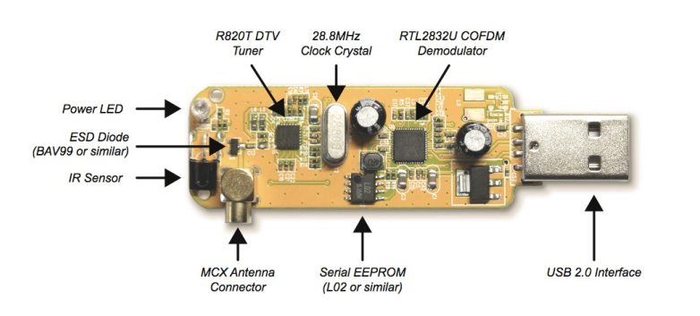

# 1. Index

- [1. Index](#1-index)
- [2. Software Defined Radio](#2-software-defined-radio)
  - [2.1. The RTL-SDR Platform](#21-the-rtl-sdr-platform)
  - [2.2. From RF to Complex Baseband](#22-from-rf-to-complex-baseband)

# 2. Software Defined Radio

In conventional radios, functions like modulation, demodulation ,filtering and frequency
conversions are implemented by dedicated analog/digital hardware.

Advances in digital processors and analog-to-digital converters allow an increasing
fraction of this functions to be implemented in software. This is the basis of
**Software Defined Radio** (SDR) technology.

Knowing that passband signals are represented through their complex envelope:

$$
  s(t) = \text{Re}\Set{\tilde{s}(t)e^{j2\pi f_c t}}
$$

Letting $v(t)$ denote the received passband signal, and $\tilde{v}(t)$ its
complex envelope, can say that $\tilde{v}(t)$ contains the amplitude and phase
evolution of the received signal:

$$
\boxed{
\begin{CD}
  \tilde{s}(t) @>>> s(t) @>>> \text{physical channel} @>>> v(t) @>>> \tilde{v}(t)
\end{CD}
}
$$

A software-defined radio converts a _selected portion_ of the received RF
spectrum into a sequence of _complex-baseband samples_:

$$
  \tilde{v}[k] = v_I[k] + j v_Q[k]
$$

Thus, the signal is converted to a digital format which is then **digitally processed**.
The RF front-end is _software-configurable_, while baseband processing is implemented
digitally and _can be reprogrammed_.

In this paradigm, common hardware platforms can support different modulation formats,
algorithms, products and applications through software reconfiguration, significantly
reducing development and production costs.

## 2.1. The RTL-SDR Platform

The SDR paradigm will be explored using an RTL-SDR, which is a low-cost, receive-only
software-defined radio. It is based on USB DVB-T dongles.

It contains a tunable RF front-end and a \_digital processing section.

The selected RF band is converted into complex baseband I/Q samples (as seen before)
and then transferred to a host computer through USB to be processed by software.

The RTL-SDR can be tuned over a wide RF range, but is only capable of capturing
a limited bandwidth around the selected center frequency.

<figure class="100">

<figcaption>

The architecture of a RTL-SDR.

</figcaption>
</figure>

## 2.2. From RF to Complex Baseband

The RTL-SDR contains two main signal-processing blocks:

- **The analog tuner**: It selects the desired RF band and translates it to a _lower
  intermediate frequency_ (IF)
- **The RTL2832U**: It samples the IF signal and performs _digital quadrature
  downconversion_, filtering and decimation.
