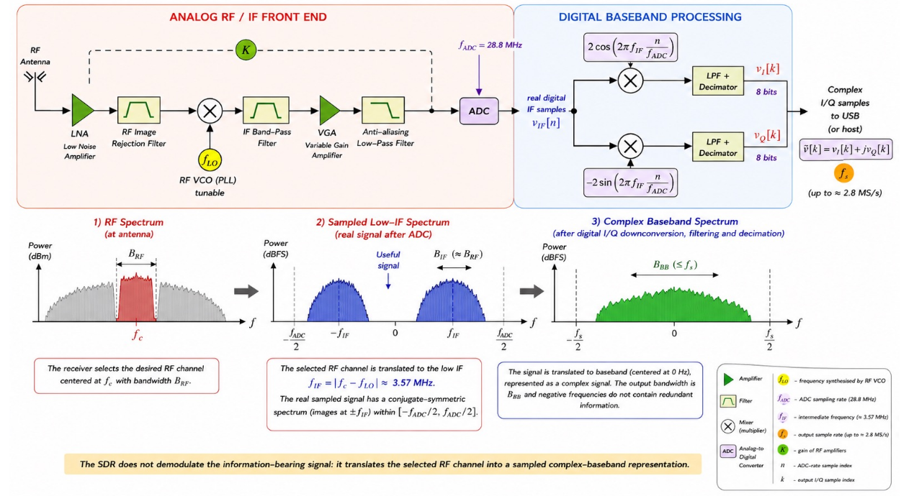

# 1. Index

- [1. Index](#1-index)
- [2. Software Defined Radio](#2-software-defined-radio)
  - [2.1. The RTL-SDR Platform](#21-the-rtl-sdr-platform)
  - [2.2. From RF to Complex Baseband](#22-from-rf-to-complex-baseband)
  - [2.3. FM Mono Broadcasting Signal](#23-fm-mono-broadcasting-signal)

# 2. Software Defined Radio

In conventional radios, functions like modulation, demodulation ,filtering and frequency
conversions are implemented by dedicated analog/digital hardware.

Advances in digital processors and analog-to-digital converters allow an increasing
fraction of this functions to be implemented in software. This is the basis of
**Software Defined Radio** (SDR) technology.

Knowing that passband signals are represented through their complex envelope:

$$
  s(t) = \text{Re}\Set{\tilde{s}(t)e^{j2\pi f_c t}}
$$

Letting $v(t)$ denote the received passband signal, and $\tilde{v}(t)$ its
complex envelope, can say that $\tilde{v}(t)$ contains the amplitude and phase
evolution of the received signal:

$$
\boxed{
\begin{CD}
  \tilde{s}(t) @>>> s(t) @>>> \text{physical channel} @>>> v(t) @>>> \tilde{v}(t)
\end{CD}
}
$$

A software-defined radio converts a _selected portion_ of the received RF
spectrum into a sequence of _complex-baseband samples_:

$$
  \tilde{v}[k] = v_I[k] + j v_Q[k]
$$

Thus, the signal is converted to a digital format which is then **digitally processed**.
The RF front-end is _software-configurable_, while baseband processing is implemented
digitally and _can be reprogrammed_.

In this paradigm, common hardware platforms can support different modulation formats,
algorithms, products and applications through software reconfiguration, significantly
reducing development and production costs.

## 2.1. The RTL-SDR Platform

The SDR paradigm will be explored using an RTL-SDR, which is a low-cost, receive-only
software-defined radio. It is based on USB DVB-T dongles.

It contains a tunable RF front-end and a \_digital processing section.

The selected RF band is converted into complex baseband I/Q samples (as seen before)
and then transferred to a host computer through USB to be processed by software.

The RTL-SDR can be tuned over a wide RF range, but is only capable of capturing
a limited bandwidth around the selected center frequency.

<figure class="100">

<figcaption>

The architecture of a RTL-SDR.

</figcaption>
</figure>

## 2.2. From RF to Complex Baseband

The RTL-SDR contains two main signal-processing blocks:

- **The analog tuner**: It selects the desired RF band and translates it to a _lower
  intermediate frequency_ (IF)
- **The RTL2832U**: It samples the IF signal and performs _digital quadrature
  downconversion_, filtering and decimation.

In the image on the right we can see the schema of all the passages between
the RF antenna and the complex I/Q samples given to the host computer.

The first step is a _Low Noise Amplifier_ `LNA`, which is an amplifier built to
specifically amplify weak signals captured by the antenna, while minimizing
the noise added to them.

This is then sent through a RF image Rejection filter, which is a bandpass
filter that removes the unwanted image frequency, coming from other signals
captured by the antenna.

The filtered signal is then modulated by a tunable RF Voltage Controlled Oscillator
that generates a frequency that is mixed with the filtered signal to produce an
intermediate frequency (IF) signal at $f_{IF} = \vert f_c - f_{LO} \vert
\approx 3.57\;MHz$, before going through a second bandpass filter to remove
the unwanted mixing products.

This sampled signal is then again amplified by a _Variable-Gain Amplifier_
`VGA`, and at last filtered by a Anti-Aliasing Low-Pass filter before being
sampled by a `8-bit ADC`, clocked at $f_{ADC} = 28.8\;MHz$.

The digital signal will then be in form of IF samples $v_{IF}[n]$ mixed with
quadrature NCO signals. The digital samples will go through two different modulation
(and high frequency filtering) to recover the $v_I[n]$ and $v_Q[n]$ components
in order to give a complex baseband signal $\tilde{v}[n] = v_I[n] + j v_Q[n]$.

The samples will arrive with a frequency up to $f_{s} = 2.8\;MS/s$, and will
be sent to the host computer through a simple USB connection.

The FM demodulation is implemented afterwards in software (like MATLAB).

## 2.3. FM Mono Broadcasting Signal

Mono FM broadcasting was introduced in 1945 and quickly became a major commercial
success.

The modulating signal $m(t)$ is obtained by combining the left $L(t)$ and
right $R(t)$ audio channels:

$$
\large
m(t) = L(t) + R(t)
$$

The message $m(t)$ is first _low-pass filtered_ to a bandwidth of $15\;kHz$,
and then **normalized** to $1$ and $k_f = 75\;kHz/V$.
In this way $\Delta f = k_f \max_t{\vert m(t) \vert} = 75\;kHz$, with $m_f =
 \frac{75}{15} = 5$.

This way, by the Bradley's rule, the FM signal will occupy a bandwidth of $B_T
= 2(\Delta f + f_m) = 2(75 + 15) = 180\;kHz$.
