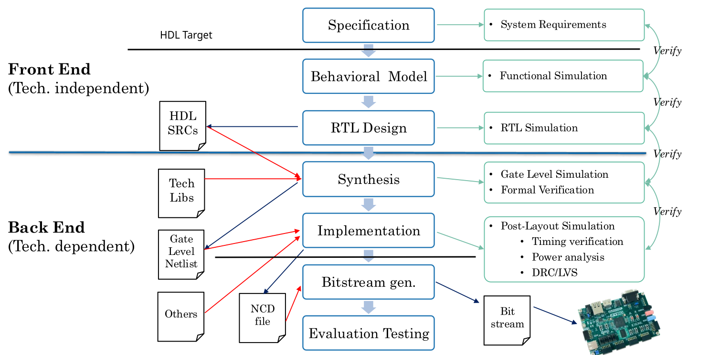

# 1. Index

- [1. Index](#1-index)
- [2. Digital Systems](#2-digital-systems)
  - [2.1. Verilog Hardware Description Language](#21-verilog-hardware-description-language)
  - [2.2. VHDL Files](#22-vhdl-files)
    - [2.2.1. Library and Types](#221-library-and-types)
      - [2.2.1.1. IEEE Types](#2211-ieee-types)
    - [2.2.2. Entity](#222-entity)
    - [2.2.3. Architecture](#223-architecture)
      - [2.2.3.1. Example: Data-Flow](#2231-example-data-flow)
      - [2.2.3.2. Example: Behavioral](#2232-example-behavioral)
      - [2.2.3.3. Example: Structural](#2233-example-structural)
  - [2.3. VHDL Rules](#23-vhdl-rules)
    - [2.3.1. Example: Full Adder](#231-example-full-adder)
    - [2.3.2. Example: DFC](#232-example-dfc)
    - [2.3.3. Example: ROM](#233-example-rom)

# 2. Digital Systems

We will be working with **Field Programmable Gate Arrays (FPGAs)**, which are
integrated circuits that can be configured by the user after manufacturing.
They consist of an array of programmable logic blocks and a hierarchy of
reconfigurable interconnects that allow the blocks to be wired together.

Some configurable resources in FPGAs include:

- Configurable Logic Blocks (CLBs)
- Embedded memory blocks (ROM, RAM)
- DSP
- I/O blocks
- Programmable interconnection matrix

The design flow for FPGAs typically involves the following steps:



From the RTL Code, which gives a logic description of the system, where logic
gates have no delay, area occupation, or power consumption, we move to the
Synthesis step, which converts the RTL code into a **Gate-Level Netlist**,
made by FPGA (family) library cells.

One important note is that the synthesis does NOT place the components on the
FPGA, that step is done in the **Implementation**, which creates a **Native Circuit
Description** (NCD) file, which is a binary file that contains the routed circuit
on the FPGA, mapping the gates with specific FPGA blocks.

## 2.1. Verilog Hardware Description Language

**Hardware Description Languages (`HDLs`)** are specialized computer languages
used to describe the structure, design, and operation of electronic circuits,
and most commonly digital logic circuits.
`HDLs` allow designers to model complex digital systems at various levels of
abstraction, from high-level behavioral descriptions to low-level gate-level representations.

Some `HDL` features:

- Executable (simulations)
- Provide levels of abstraction
- Description of **hardware systems as a software model**
- Independent from technology, design methodology, design style or _design tool_.

## 2.2. VHDL Files

`VHDL` works modeling any digital systems, with _5 parts_ called **_Design Units_**:

1. **Entity Declaration**: describes the interface of the design unit, including
   its inputs, outputs, and parameters.
2. **Architecture Body**: describes the internal behavior and structure of the
   design unit, including its logic and data flow.
3. **Package Declaration**: defines a collection of related design units,
   including types, constants, and functions.
4. **Package Body**: provides the implementation of the design units defined
   in the package declaration.
5. **Configuration Declaration**: specifies how the design units are connected
   and instantiated in a larger system.

Each file follows the same structure:

- Library
- Entity
- Architecture

### 2.2.1. Library and Types

The main official `VHDL` packages are distributed in two libraries called `std`
and `ieee`:

- `std.standard`: basic VHDL types and some function.
- `std.textio`: Line and Text types, input output files and related functions.
- `ieee.std_logic_1164`: IEEE standard synthesizable types, functions and operators
  (most used package)
- `ieee.fixed_pkg`: used for synthesis of fixed-point arithmetics.
- `ieee.numeric_std`: used for integer mathematics, it defines unsigned and
  signed types with functions and operators.
- `ieee.math_real`: generally used to determine generics parameters using real
  values. (not used in synthesis)

```vhdl
library std;
  use std.standard.all;
  use std.textio.all;

library ieee;
  use iee.std_logic_1164.all;
  use ieee.numeric_std.all;
  use.fixed_pkg.all;
  use ieee.math_real.all;

library work;
  use work.my_package.all;
```

If not specified, the default library where all user-defined entities are
compiled is `WORK`.

`VHDL` is a strongly typed language, and does not allow implicit type conversions.

Possible data types are:

- Scalar:
  - Numeric: integer, floating, physical
  - Enumeration: ordered symbols/char
- Composite:
  - Array: also multi-dimensional
  - Record: composition of different types

Other data types only available in simulations are:

- Access
- File

The package **standard** has only `bit` and `bit_vector` types to represent logic.

This is ideal for high-level design, where available states are only `0` and
`1`, but not for low-level design, where we need to represent `-` or `Z` states.

`IEEE` library provides the `std_logic_1164` package, which defines multi-value
logic system:

```vhdl
type std_logic is (
  'U', -- Uninitialized
  'X', -- Forcing Unknown
  '0', -- Forcing 0
  '1', -- Forcing 1
  'Z', -- High Impedance
  'W', -- Weak Unknown
  'L', -- Weak 0
  'H', -- Weak 1
  '-', -- Don’t care
);
```

#### 2.2.1.1. IEEE Types

A _resolved (sub)type_ is a type that has a resolution function associated
with it, meaning it is defined how to combine multiple drivers of the same signal.

The `std_logic` type is a **resolved subtype**, which means that if multiple
drivers are connected to the same signal, the resolution function will
determine the final value of the signal based on the values of the drivers.

By default, if we have an **unresolved subtype** driven by more than one
driver, the compiler will throw an error, as it is not clear what the final
value of the signal.

If the behaviour is expected by the programmer, the **resolved** keyword can
be used to define a signal as a resolved subtype, bypassing the _compiler error_.

### 2.2.2. Entity

A typical `VHDL` entity declaration looks like this:

```vhdl
entity entity_name is
  -- Entity generalization [optional, can be use for code reuse]
  generic (
    constant_name: constant_type := constant_value;
    constant_name: constant_type := constant_value;
  ...);
  -- Define the entity interface
  port (
    port_name: port_mode port_type;
    port_name: port_mode port_type;
  ...);
end entity;
```

The declaration describes **the external view of the entity**.

The main `port_modes` that define the _entity interface_ are `in`, `out` and `inout`:

```vhdl
-- To avoid linking problems, the entity name must be the same as the file name
entity HalfAdder is
  port (
    a  : in  std_logic;
    b  : in  STD_LOGIC;    -- VHDL is case-insensitive
    co : out std_logic;
    s  : out std_logic     -- last port has no `;`
);
end entity;
```

### 2.2.3. Architecture

The architecture body contains **the internal description of the entity**.

A design can be expressed in _any combinations_ of **_these four descriptive
styles_**:

1. **Behavioral**: Uses _sequential programming statement_ (`if`, `for`, `while`,
   `case`, etc.) to describe the system behavior.
2. **Data Flow**: Uses _concurrent programming statements_ (`when`, `else`, `and`,
   `or`, `xor`, `not`, ...) to describe the flow of data through the system.
3. **RTL**: collection of combinational blocks interconnected by registers.
4. **Structural**: describes the system with **component instantiation** and
   their interconnections.

The structure of the _architecture_ is as follows:

```vhdl
architecture architecture_name of entity_name is

  -- Declarations of signals, constants, types, components, etc.

begin

  -- Statements describing the behavior or structure of the entity

end architecture;
```

#### 2.2.3.1. Example: Data-Flow

Let's suppose to use the `HalfAdder` entity defined above, we can implement its
architecture in a data-flow style:

```vhdl
architecture dataflow of HalfAdder is

begin
  co  <=  a and b;   -- statement 1
  s   <=  a xor b;   -- statement 2
end architecture;
```

The assignment can be done in two different ways:

- `<=` used to assign values to signals
- `:=` used to assign values to _variables_, _constants_ and _initial values_.

Its important to note that **THE STATEMENTS IN THE ARCHITECTURE ARE
CONCURRENT**, meaning that they are executed at the same time, and not in a
sequential order.

#### 2.2.3.2. Example: Behavioral

In this kind of architecture, we use sequential statements to describe the
behavior of the entity.

To be able to do so, we use the `process` statement, which allows us to group
sequential statements together.

```vhdl
architecture behavioral of HalfAdder is
begin
  -- p_CARRY is the name of the process
  -- a and b are the sensitivity list of the process (arguments)
  p_CARRY: process(a, b)
  begin
    -- sequential statements
    if (a and b) = '1' then   -- comparison is done by a single `=`
      co <= '1';
    else
      co <= '0';
    end if;
  end process;

  s <= a xror b; -- concurrent statement
end architecture;
```

The `process` will be activated (executed) whenever one of the signals in the
sensitivity list changes its value.

#### 2.2.3.3. Example: Structural

In this kind of architecture, we describe the system by instantiating `components`,
which are other entities, and connecting them together.

```vhdl
architecture structural of HalfAdder is

  -- Declare the components to be instantiated

  component MY_AND is
    port (
      AND_in1 : in std_logic;
      AND_in2 : in std_logic;
      AND_out : out std_logic
    );
  end component;

  component MY_XOR is
    port (
      XOR_in1 : in std_logic;
      XOR_in2 : in std_logic;
      XOR_out : out std_logic
    );
  end component;

begin
  -- Architecture body

  i_AND : MY_AND    -- instance of the component MY_AND
  port map (
    AND_in1 => a,     -- Explicit port association
    AND_in2 => b,     -- Use `=>` and `,`
    AND_out => co,    -- last port has no `,`
  );

  i_XOR : MY_XOR
  port map (a, b, co)
  -- positional port association is possible but discouraged

end architecture;
```

## 2.3. VHDL Rules

Logical operators in `VHDL` can be _binary_ (takes two inputs) or _unary_
(takes one input).

```vhdl
bit <= b1 and b2;     -- Does an AND between b1 and b2

bit <= and "001";     -- Does an AND between all bits of the vector "001"
```

When working with multiple logical operators, we need to be careful with the
**operator precedence**:

```vhdl
bit <= and vec_a or vec_b   -- Illegal! AND is evaluated before OR
bit <= and (vec_a or vec_b) -- Legal! ALWAYS USE PARENTHESES
```

While working with vectors, we can use expressions in _data aggregation_:

```vhdl
vect(4 downto 0)  <=  "11101";  -- assign a vector of 5 bits
vect(0 to 4)      <=  "10111";  -- is the same as the previous

-- Initialize a vector with a single value
vect <= (others => '0');        -- assign all bits to 0

-- Set a portion to a value, and the rest to another value
vect <= (0|2 => '0', others => '1');  -- assign bits 0 and 2 to 0, the rest to 1
```

We can make conditional signal assignments using the `when` statement:

```vhdl
z <=  a when s0 = '1' else
      b when s1 = '1' else
      c;
```

We can also use the `with-select` statement:

```vhdl
sig <= A & B;
with sig select
  Y <= '0' when "00",
  Y <= '1' when "01",
  Y <= '1' when "10",
  Y <= '0' when "11";
```

**Only inside processes** we can use _sequential statements_:

```vhdl
-- loop
loop
  exit when value <= 0.0;
  value := value / 2.0;
end loop;

-- while and next
while value > 0 loop
  next when value = 5;
  value := value / 2;
end loop;

-- for
for I in 16 downto 0 loop
  for J in 0 to 8 loop
    tab(I)(J) := I*J + 5;
  end loop;
end loop;
```

```vhdl
-- if statement
if A > B then
  Max <= A;
elsif A < B then
  Max <= B;
else
  Max <= 0;
end if;

-- case statement
case Int is
  when 0      => B <= 4;
  when 1|2|7  => B <= 10;
  when 3 to 6 => B <= 5;
  when 9      => null;
  when others => B <= 0;
end case;

process (SEL, A, B, C, D)
  case SEL is
    when "00"   => MUX_OUT <= A;
    when "01"   => MUX_OUT <= B;
    when "10"   => MUX_OUT <= C;
    when "11"   => MUX_OUT <= D;
    when others => MUX_OUT <= (others => '0');
  end case;
end process;
```

Some conversion function defined in the `std_logic_1164` package are:

```vhdl
to_bit(s : std_ulogic)
to_bitvector(s : std_ulogic_vector)
to_stdlogic(s : bit)
to_stdlogicvector(s : bit_vector)

-- Cast incompatible `std_logic_vector` and `std_ulogic_vector` types
A <= std_logic_vector(B);
B <= std_ulogic_vector(A);
```

To do _edge detection_ we can use the `rising_edge` and `falling_edge` functions.

### 2.3.1. Example: Full Adder

```vhdl
library ieee;
use ieee.std_logic_1164.all;

entity FullAdder is
  port (
    a   : in  std_logic;
    b   : in  std_logic;
    cin : in  std_logic;
    cout: out std_logic;
    s   : out std_logic
  );
end entity;

architecture dtaflow of FullAdder is
begin
  s     <= a xor b xor cin;
  cout  <= (a and b) or (a and cin) or (b and cin);
end architecture;
```

### 2.3.2. Example: DFC

Asynchronous negative reset.

```vhdl
entity DFC is
  port (
    clk     : in  std_logic;
    resetn  : in  std_logic;
    d       : in  std_logic;
    q       : out std_logic;
  );

architecture rtl of DFC is
begin
  p_DFC: process(clk, resetn)
  begin
    if resetn = '0' then
      q <= '0';
    elsif (clk'event and clk = '1') then    -- positive edge detection
--  elsif rising_edge(clk) then
      q <= d;
    end if;
  end process;

end architecture;
```

Synchronous negative reset.

```vhdl
entity DFC is
  port (
    clk     : in  std_logic;
    resetn  : in  std_logic;
    d       : in  std_logic;
    q       : out std_logic;
  );

architecture rtl of DFC is
begin
  p_DFC: process(clk)
  begin
    if rising_edge(clk) then
      if resetn = '0' then
        q <= '0';
      else
        q <= d;
      end if;
    end if;
  end process;

end architecture;
```

### 2.3.3. Example: ROM

```vhdl
library ieee;
use IEEE.std_logic_1164.all;
use IEEE.numeric_std.all;     -- needed for unsigned and signed types

entity LUT_32x8 is
  port (
    addr  : in  std_logic_vector(4 downto 0);
    datao : out std_logic_vector(7 downto 0)
  );
end entity;

architecture dataflow of LUT_32x8 is
  signal    addr_int : integer range 0 to 31;    -- Always specify range

  -- Type definition
  type      lut_t    is array (0 to 31) of std_logic_vector(7 downto 0);
  constant  lut      :  lut_t :=
  ("00011000","00011001","00011010","00011100","00111000","01011001","10011000","11011001",
"00010000","00010001","00010010","00010100","00110000","01010001","10010000","11010001",
"00001000","00001001","00001010","00001100","00101000","01001001","10001000","11001001",
"00000000","00000001","00000010","00000100","00100000","01000001","10000000","11000001");

begin
  addr_int  <= to_integer(unsigned(addr));   -- convert std_logic_vector to integer
  datao     <= lut(addr_int);
end architecture;
```
